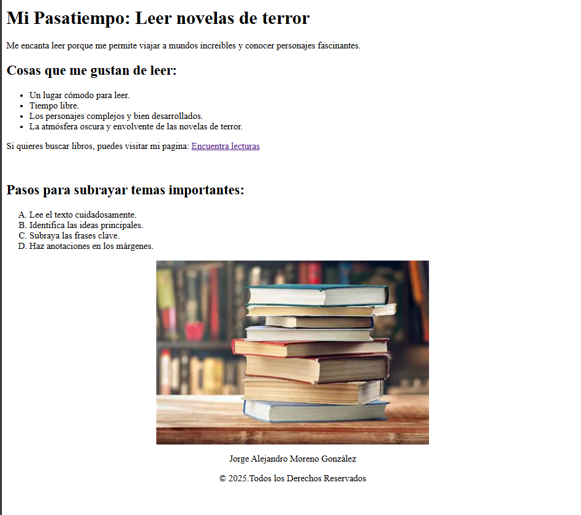

# **Etiquetas 1 Pasatiempo**

#### Este es nuestro primer codigo de **HTML** realizado en clase, para empezar nuestros primeros pasos por el camino a la programación web. Aprendiendo de las primeras etiquetas basicas como se mostrara en el siguiente código:

```HTML
<!DOCTYPE html>
<html lang="en">
<head>
    <meta charset="UTF-8">
    <meta name="viewport" content="width=device-width, initial-scale=1.0">
    <title>Pasatiempo</title>
</head>
<body>
    <!-- Etiqueta de encabezado (ctrl + k + c) (ctrl + k + u) -->
    <h1>Mi Pasatiempo: Leer novelas de terror</h1>
    <p>Me encanta leer porque me permite viajar a mundos increibles y conocer personajes fascinantes.</p>
    <h2>Cosas que me gustan de leer: </h2>

    <!-- Lista desordenada -->
    <ul>
        <li>Un lugar cómodo para leer.</li>
        <li>Tiempo libre.</li>
        <li>Los personajes complejos y bien desarrollados.</li>
        <li>La atmósfera oscura y envolvente de las novelas de terror.</li>
    </ul>
    <p>Si quieres buscar libros, puedes visitar mi pagina: <a href="https://www.milibros.com">Encuentra lecturas</a></p>
    <br> <!-- Salto de linea -->
    
     <h2>Pasos para subrayar temas importantes: </h2>
     <!-- Lista ordenada consultar pagina web-->
      <ol type="A" start="1">
        <li>Lee el texto cuidadosamente.</li>
        <li>Identifica las ideas principales.</li>
        <li>Subraya las frases clave.</li>
        <li>Haz anotaciones en los márgenes.</li>
      </ol>

      

      <p style="text-align: center;">Jorge Alejandro Moreno González</p>
       <p style="text-align: center;"">&copy; 2025.Todos los Derechos Reservados</p>

</body>
</html>
```
#### Este es nuestro resultado final de como se ve visualmente por medio de nuestro navegador web.




###### Alumno: **_Jorge Alejandro Moreno González_**
###### Maestro: **_Pedro Espinosa Esparza_**
###### Materia: **_Programación Web_**